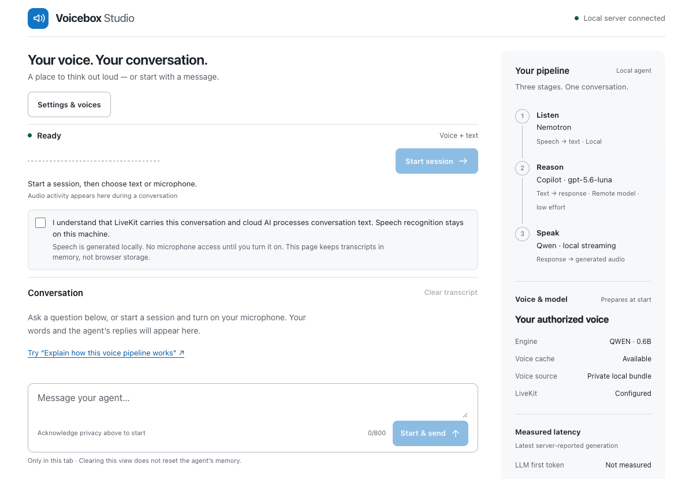

# LiveKit Voice Studio

The standalone setup runs Qwen directly with this project's private voice library.
It does not require the separate Voicebox application or HTTP server. The older
Voicebox adapter remains optional; existing `VOICEBOX_*` configuration names and
Python package imports remain compatible.

Talk with **GitHub Copilot or OpenAI Codex** using a voice you've recorded or have permission to use.

Record a short reference, hear it say something new, then start a conversation.
Speech recognition and generation run on your Mac; you choose the service that
answers. The Voicebox desktop app can stay closed.



## Development preview

The source is available under MIT, with separate licenses for dependencies and
models. This is an early single-user app for Apple Silicon, not a fully offline
assistant or a supported production service. LiveKit and the selected reasoning
provider require your own accounts.

Synthetic spoken tests cover replies, deliberate interruption, pauses and recovery.
One earlier intermittent provider failure remains unexplained; response speed varies.
Human listening and an independent user installation are still needed. See the
[preview release notes](docs/preview-release.md) for tested scope and limitations.

## Set it up with your coding agent

Give Codex, Copilot, or another coding agent this prompt:

> Set up Voicebox Studio on this machine. Read https://github.com/c-mongan/livekit-voice-studio/blob/main/docs/agent-quickstart.md and follow it. Reuse existing installations and preserve my settings. Ask before model downloads or paid service setup. Let me complete sign-in and voice consent. Verify the app and report what works and what is still blocked.

The [agent quickstart](docs/agent-quickstart.md) provides an ordered setup and
verification checklist. It cannot supply accounts, bypass permissions, or guarantee
compatibility with every machine. Prefer the manual guide below if you want to
run each step yourself.

## Copilot or Codex?

| Reasoning provider | What has been verified |
| --- | --- |
| GitHub Copilot | Complete spoken conversations, interruption and follow-up with local speech |
| OpenAI Codex | Restricted-agent preflight and two-turn reasoning/memory; full Codex speech pipeline still unverified |

Both generate conversation replies; local Nemotron recognizes speech and Qwen
speaks it. You need your own compatible account and installed CLI. Copilot uses
no tools; Codex requires a separate restricted-agent consent step. See
[provider setup and boundaries](docs/agent-providers.md).

## Get started

The tested setup is an **Apple Silicon Mac with 16 GB RAM**, Python 3.12,
Node.js 22.12+ and [uv](https://docs.astral.sh/uv/).
You'll also need:

- Qwen TTS 0.6B weights and the Nemotron CPU recognizer, installed explicitly.
- A voice you own or have permission to use.
- A LiveKit project and a supported reasoning account: Copilot, Codex,
  Azure OpenAI or OpenAI.

**New installation? Follow the [first-run guide](docs/quickstart.md).**
It covers dependencies, model downloads, disk space and private configuration.
Nothing downloads automatically when you open the app.
After installing dependencies, `./studio doctor` checks setup without contacting
providers or loading models and tells you what to fix next.

For an already configured checkout:

```sh
./studio start --open
```

The command finishes while macOS keeps the server running.
Use `./studio status` to check it and `./studio stop` when you're done.
See [launching and recovery](docs/launching.md) for details.

## Record → audition → chat

1. **Record** 5–30 seconds in a quiet room. Check that the transcript matches.
2. **Audition** the saved voice with new text. This is generated speech, not
   a replay of your recording.
3. **Choose** the voice, start a session, then type or turn on your microphone.

You can interrupt a reply, keep several voices, and switch reasoning providers
between sessions. The microphone stays off until you enable it.

## What stays local?

| Stage | Default route |
| --- | --- |
| Listen | Nemotron turns speech into text on your Mac |
| Answer | Copilot receives conversation text and uses a remote model |
| Speak | Qwen generates audio locally from your selected voice |
| Connect | LiveKit carries conversation audio and coordinates the room |

**Local-first is not fully offline.** Reference recordings stay on your machine;
live conversation audio travels through LiveKit and text goes to the reasoning
provider. Choosing cloud transcription also sends speech to that provider.
Session recording is disabled, and the page keeps transcripts in memory rather
than browser storage. Provider-side retention depends on your account and terms.

Copilot is configured without tools. Codex requires explicit consent to a
restricted agent—not tool-free mode. Neither option changes your normal coding
sessions. Read the [provider boundaries](docs/agent-providers.md) before using
sensitive content.

Local auditions and [read-aloud](docs/read-aloud.md) don't need a reasoning request
or LiveKit. Read-aloud can speak a short excerpt of an existing reply, including
an opt-in Codex notification, with Stop and mute controls.

[Current standalone validation and remaining checks](docs/oss-readiness.md)

## Status and limits

This is an **experimental, single-user app**, not a production service.
Keep it on loopback; don't expose the token broker through a public tunnel.
One conversation or audition owns inference at a time.

The fast voice path and managed launcher are tested on Apple Silicon.
Voice likeness, accents, noisy microphones and performance on other hardware
need your own testing. Start with the [listening checklist](docs/voice-quality.md).
See [compatibility and measured results](COMPATIBILITY.md) for what was actually
tested—small synthetic samples are not a latency guarantee.
The [evaluation guide](docs/evaluation.md) provides repeatable offline checks and
an explicit opt-in spoken timing report.

## Under the hood

Studio uses LiveKit's supported room, transcription and interruption APIs.
Qwen runs directly through MLX Audio with a saved local reference; it doesn't
require the Voicebox app or server. The separate
[`livekit-plugins-voicebox` Python plugin](livekit-plugins-voicebox/README.md)
supports the original Voicebox HTTP backend. No package or model weights are
published with this repository.

[Architecture](docs/architecture.md) · [Voice settings](docs/voices-and-providers.md) ·
[Existing Voicebox imports](docs/voice-performance.md) · [Troubleshooting](docs/troubleshooting.md)

## Credits and contributing

The UI adapts LiveKit's MIT-licensed React agent starter. Studio builds on
LiveKit, Voicebox, MLX Audio, Qwen and NVIDIA's Nemotron speech runtime.
Code, model weights and native dependencies have separate license terms;
see [provenance](docs/provenance.md), [compatibility](COMPATIBILITY.md#license-boundaries)
and [third-party notices](web/THIRD_PARTY_LICENSES).

[MIT license](LICENSE) · [Contributing](CONTRIBUTING.md) · [Security reporting](SECURITY.md)

For source-release contents and license boundaries, see [release preparation](docs/releasing.md).

## Learn by using the app

**First conversation guide** shows local setup checks and the next steps.
**Check microphone** offers an eight-second browser-only recording and replay.
**Learn LiveKit** reveals the connection, pipeline, and actual measured timings.
Start with [hands-on exercises](docs/learn-livekit.md), then use the separate
[cloud learning example](docs/cloud-learning.md) to explore named agent dispatch.
The cloud example uses stock voices and does not upload your private reference.

Experimental delivery comparisons are kept separate from conversation defaults.
See [expressive voice experiments](docs/expressive-experiment.md) for the evidence
needed before calling a local cloned voice expressive.
