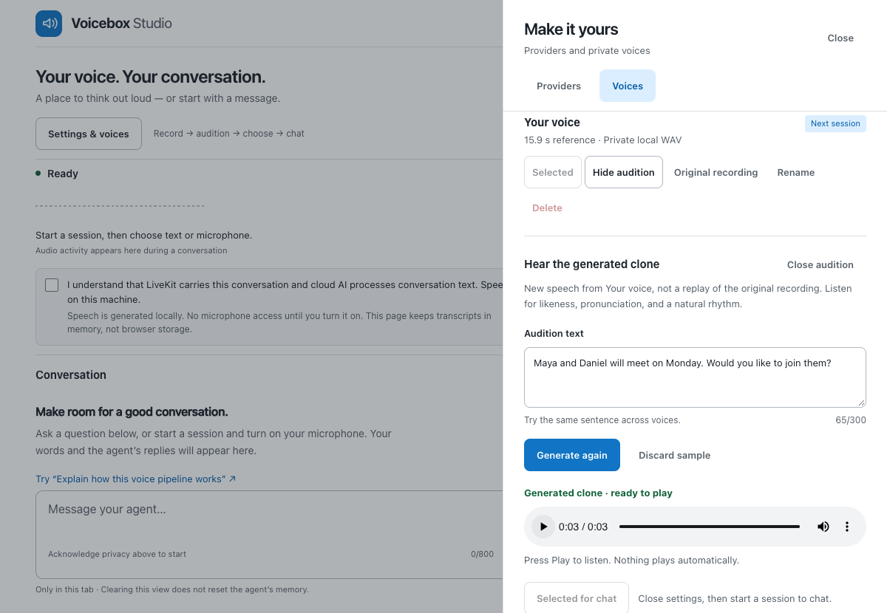

# Voicebox for LiveKit

**Record your voice. Choose an assistant. Have a conversation.**

Voicebox Studio is a small local web app built around the `livekit-plugins-voicebox`
Python plugin. It brings together a conversation, a microphone, and a readable
view of what each part of the system is doing.


*The running app before a conversation. The private voice name is redacted;
latency stays “Not measured” until a real response.*

This is a working technical prototype, not a production service. It supports
**one conversation at a time** with Qwen TTS 0.6B, including an optional fast
streaming mode on Apple Silicon. The local-first setup uses **Nemotron for
recognition, Copilot Luna/low for reasoning, and Qwen for speech**. Codex Luna/low
and Azure are explicit alternatives. Voice processing stays local in this setup;
LiveKit carries conversation audio and the reasoning provider receives text.

## What does LiveKit add?

Voicebox turns text into speech. It does not connect a browser microphone to an
assistant, carry the audio back, or coordinate a conversation.

LiveKit handles that connection. Its Agents SDK coordinates listening, model
responses, speech playback, transcripts, and interruptions. You can change the
voice or language model without rebuilding the browser's audio plumbing.

```text
Your browser             LiveKit             Local conversation agent
microphone or text ────── audio/data ────────> Nemotron: speech → text
                                             Copilot/Codex/Azure: text → answer
speaker + transcript <── audio/data ───────── Qwen: answer → your selected voice
```

**Nemotron listens. The LLM answers. Qwen speaks. LiveKit connects them.**
Voicebox's HTTP backend remains supported; fast mode runs Qwen directly and does
not need the Voicebox app open.

## Run Studio

For the complete record → audition → chat path, use the
[Apple Silicon first-run guide](docs/quickstart.md).

The fast local-voice demo requires an **Apple Silicon Mac**. The original HTTP
plugin and Studio broker also support macOS/Linux. You need Python 3.11–3.13,
Node.js 22+, [uv](https://docs.astral.sh/uv/), and:

- Existing Qwen TTS **0.6B weights**. Record an authorized reference in Studio
  or import your existing Voicebox voice.
- A LiveKit project and a signed-in Copilot CLI with the selected model available.
  Codex, Azure and OpenAI have their own optional account requirements.
- The explicitly installed [Nemotron CPU runtime and model](docs/local-stt.md)
  for local recognition; Azure Speech and OpenAI transcription are alternatives.

### 1. Install once

```sh
uv sync --frozen --package livekit-plugins-voicebox \
  --extra dev --extra example --extra azure --extra agents --python 3.12
npm --prefix web ci
npm --prefix web run build
```

Skip `--extra azure` if you do not need Azure. On Apple Silicon, add
`--extra mlx` for fast local Qwen; see [fast-mode setup](docs/voice-performance.md#enable-the-experimental-studio-fast-mode).
These commands do not download Voicebox/Qwen weights. Silero's small voice-activity
model is bundled with its Python plugin.
The `agents` extra supplies the Copilot SDK and uses your installed CLI; it does
not install another Codex binary. Local Nemotron has its own explicit
[CPU runtime setup](docs/local-stt.md), including a roughly 700 MB public model.

### 2. Configure locally

Copy `.env.example` to `.env` **only if `.env` does not already exist**.
Add your LiveKit URL, API key and secret. For fast mode, set
`VOICEBOX_TTS_BACKEND=mlx` and `VOICEBOX_MLX_MODEL_PATH` to the complete existing
model snapshot. Configure the Nemotron paths using its setup guide.
An existing `VOICEBOX_PROFILE` or private bundle is optional if you will record
your voice in Studio. Keep credentials out of source control.

Stop other Voicebox workers and desktop generation, then set `VOICEBOX_EXCLUSIVE=1`.
Studio cannot detect every other process using the Voicebox server.

```sh
uv run --no-sync python -m examples.studio --check
```

The check is read-only. It explains what is missing without printing your keys.
On a fresh installation, a missing voice is expected until you record and select
one in the UI; the server can still start for enrollment.
[Configuration details](examples/README.md) cover OpenAI, Azure CLI authentication,
and explicitly warming an already cached voice model.

### 3. Start

```sh
uv run --no-sync python -m examples.studio
```

Open **http://127.0.0.1:8765**. Start with text, or enable your microphone to speak.
The microphone stays off until you choose to enable it.

### Record your own voice

Open **Settings & voices → Voices → Record a voice**. Read the short passage,
listen back, correct the transcript if needed, and confirm permission before saving.
Choose the saved voice for the next conversation. Recording and voice changes
are disabled during active conversations so references cannot get mixed.

Before choosing, try a **Generated audition** with new text. This is the cloned
voice speaking, not a replay of your microphone recording. Auditions run locally,
without the LLM or LiveKit, and cannot overlap a conversation. Generated audio
is temporary and is not saved to your library.

Voice references are private local files, not model finetunes. The app checks
duration, silence and clipping, but you should still judge likeness by listening.
It includes no celebrity/public-figure voice recordings.
Use the [listening checklist](docs/voice-quality.md) to compare names, numbers,
questions and pacing.



### Choose what listens and what reasons

The **Providers** tab separates speech recognition from reasoning. Local Nemotron
recognition and local Qwen speech can be paired with Copilot or Codex runtime
presets, or with Azure/OpenAI. Account/runtime restrictions are checked explicitly;
an unavailable adapter is disabled with a reason, not silently substituted.

Copilot and Codex run locally as agent processes but their language-model
requests are still cloud requests. A locally installed CLI is not an offline LLM.
See [voices and provider settings](docs/voices-and-providers.md) and
[agent-provider boundaries](docs/agent-providers.md).

You do **not** run a separate agent worker alongside Studio. Studio starts one
agent for its room and closes it when the session ends. Stop reply interrupts
playback; End session disconnects the room and waits for outstanding inference
to drain. A new session becomes available only after safe completion.

For UI development, run `npm --prefix web run dev` alongside Studio. The Vite
server is bound to loopback and proxies API requests to port 8765.

## Keep Voicebox closed in Studio

New voices recorded in Studio already work without Voicebox. To reuse an
existing Voicebox profile instead, import **only the voice you have authorized**
once while Voicebox is running:

```sh
uv run --no-sync python -m examples.voice_bundle --authorized \
  --output "$HOME/.local/share/voicebox-studio/voices/my-voice"
```

The command uses the selected profile and existing model path in `.env`.
It saves the reference recording and transcript in a private folder, not your
repository. It copies no model weights, runs no inference, and uploads nothing.
It refuses to overwrite an existing bundle or choose an arbitrary sample.

Set `VOICEBOX_VOICE_BUNDLE` to that folder and keep `VOICEBOX_TTS_BACKEND=mlx`.
You can now quit Voicebox and run Studio normally. The current fast implementation
requires a single-reference voice and Apple Silicon.

**Verified with Voicebox's server offline:** two real LiveKit sessions received
non-silent replies in **2.49 s and 2.35 s from typed input**, including Azure.
Those particular checks used typed input; they do not establish listener-rated
likeness.

## Use just the Python plugin

```python
from livekit.agents import AgentSession
from livekit.plugins import voicebox

session = AgentSession(
    stt=your_speech_provider,
    llm=your_language_model,
    tts=voicebox.TTS(profile="Your authorized voice"),
)
```

Install from this checkout with
`python -m pip install -e ./livekit-plugins-voicebox`.
No package has been published. The plugin works independently of Studio.

## What to expect

With explicit local VAD and speculative reasoning disabled, five synthetic-spoken
turns in one room received non-silent replies in **3.18 s median**, with a
**3.63 s slowest observed turn**. This includes local Nemotron, Copilot Luna/low,
local Qwen and LiveKit transport; model preparation happens before the conversation.
The same synthetic phrase was repeated, so this is a small diagnostic sample,
not an accent benchmark or a p90 claim.

Both agent adapters also passed earlier two-turn memory checks and real
browser reply → Stop → next-reply flows. Codex requires explicit consent to its
[restricted-agent mode](docs/agent-providers.md), not unrestricted coding access.

These are observations on one M4 Mac, not a provider ranking.
Real-human accents, microphone conditions and voice likeness still
need listening tests.

**The original Voicebox HTTP path is not instant.** Voicebox finishes a WAV before sending it.
LiveKit can split a response into sentences, but that is not real-time model
streaming. A faster UI or a new LLM does not remove the TTS wait.

Two local Studio checks measured **22.7 s and 12.1 s** from typed input to
non-silent remote audio. Azure produced its first token in about **1.7–1.8 s**;
Voicebox accounted for most of the remaining delay. These are two observations
on one machine, not a benchmark distribution or a latency promise.

The existing Azure `gpt-4.1-nano` deployment was retained. A new model deployment
would add setup and cost without addressing the main observed bottleneck.
[Compatibility and measured results](COMPATIBILITY.md) separate what works from
what still needs human testing.

The optional Apple Silicon fast mode uses the same cached model and authorized
reference. Its direct warm benchmark produced first non-silent PCM in
**0.36–0.63 seconds**. Two full Studio room checks then received non-silent audio
**2.23 s and 2.62 s after typed input**, including the cloud LLM and transport.
Stop reply and the following turn also worked in the browser.
See [local voice performance](docs/voice-performance.md) for setup, preparation
costs and reproducible results. These small samples are not a promise for every PC.

## Privacy and boundaries

- LiveKit carries conversation audio. Nemotron recognizes speech locally;
  choosing cloud STT sends microphone audio to that provider. The LLM receives
  conversation text. This is **not** an entirely offline assistant.
- Reference recordings stay on your machine. Fast mode reads the selected
  reference into local memory; it is not sent to the LLM or browser.
- Keys stay on the Python server. The browser gets a short-lived token for its
  one room, not your LiveKit API secret or Azure credentials.
- Copilot/Codex reasoning uses those providers' account access and usage limits.
  It is not a free or offline replacement for a language-model service.
- Local recognition, generated auditions and local TTS have no LLM API token
  charges. Conversation reasoning still consumes provider usage; LiveKit has its
  own plan limits. Studio disables speculative reasoning requests and explicitly
  uses local VAD turn detection; this favors predictable usage over latency overlap.
- Session recording is disabled. The UI keeps its transcript in memory, not
  local storage. Upstream Voicebox logging can still contain synthesis text.
- The app binds to loopback. Do not expose this development token service to the
  internet; it is not a multi-user authenticated deployment.
- Use voices only with permission. Valid audio does not prove speaker identity.

## If something goes wrong

| Problem | What to do |
| --- | --- |
| Model missing or unloaded | Check the existing Voicebox Models screen; run the explicit warm-up only when cached |
| Another session owns the backend | End the other session or stop its worker |
| End session says draining | Wait; stopping playback does not stop the model's inference thread |
| Completion is unknown | Restart Voicebox, then restart Studio with `--confirm-backend-restarted` |
| Microphone is denied | Keep using text, or grant microphone access in your browser |
| No sound | Use the browser's audio-start control and check your output device |

Never clear an unresolved-work warning just because `/health` responds.
[Lifecycle details](docs/architecture.md) explain why the app fails closed.

## Built on existing open source

The UI adapts a small, MIT-licensed part of LiveKit's official
[React agent starter](https://github.com/livekit-examples/agent-starter-react)
and uses LiveKit's supported React and RTC APIs. It leaves out the starter's
video, avatar and large component stack to keep this local app focused.
See [source provenance](docs/provenance.md) for the pinned revision and comparison.

## Development

```sh
uv run --no-sync ruff check .
uv run --no-sync ruff format --check .
uv run --no-sync mypy
uv run --no-sync pytest -m "not integration"
npm --prefix web run typecheck
npm --prefix web test
npm --prefix web run build
uv build --package livekit-plugins-voicebox
```

[Contributing](CONTRIBUTING.md) · [Architecture](docs/architecture.md) ·
[Demo checklist](docs/demo.md) · [Voice quality](docs/voice-quality.md) ·
[Security](SECURITY.md) · [Benchmarking](benchmarks/README.md) · [MIT license](LICENSE)
