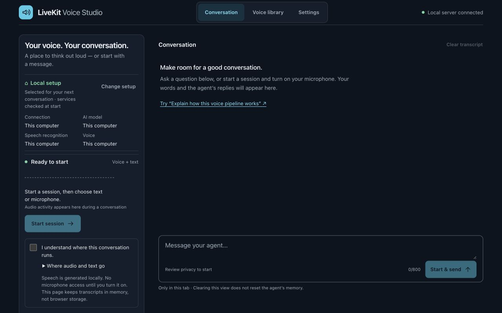

# LiveKit Voice Studio

**Talk to local or cloud AI in a voice you choose.** Record a voice you own or
have permission to use, try it with new text, then start a conversation.

Run the whole voice pipeline on your Mac, or switch individual components to
cloud services. Explore LiveKit rooms, speech, interruption and recovery through
a working app—with setup checks and troubleshooting exercises built in.



[Get started](docs/quickstart.md) · [Choose local or cloud](#choose-your-setup) ·
[See the demo](docs/demo.md) · [Learn LiveKit](docs/learn-livekit.md)

> **Development preview:** MIT-licensed, single-user, and tested on Apple Silicon.
> The local voice path uses Qwen directly through MLX Audio. You do not need the
> separate Voicebox app. Models and dependencies have their own licenses.

## Choose your setup

Each component has a separate job. Choosing a cloud language model does not move
your speech models to the cloud; choosing LiveKit Cloud does not move your agent
worker there.

| Component | What it does | Local option | Other options |
| --- | --- | --- | --- |
| LiveKit | Connects the browser and voice agent | Local LiveKit server | LiveKit Cloud or your self-hosted server |
| Speech recognition | Turns your speech into text | Nemotron | Configured OpenAI or Azure speech |
| Language model | Writes the reply | Ollama or a local compatible server | Codex, Copilot, OpenAI, Azure or a compatible endpoint |
| Voice generation | Speaks the reply in your chosen voice | Qwen through MLX Audio | Optional existing Voicebox HTTP adapter |

**New installations default to local LiveKit + Nemotron + Ollama + Qwen.**
Existing installations keep their saved settings. Change components in
**Settings → Connection & AI** between sessions. Missing services produce an
error; Studio never silently switches to cloud or downloads a model.

### Entirely local

Use local LiveKit, Nemotron, Ollama and Qwen. Recognition, reasoning, generated
speech and room transport all run on your computer. No cloud AI account or
LiveKit Cloud project is needed for this setup.

Start with an installed small chat model such as `qwen3:1.7b`. You can choose
another installed Ollama model, or supply an OpenAI-compatible model server.
Models share memory with the speech pipeline, so larger is not always better.
See [local setup, model choices and memory](docs/local-cloud-components.md).

This route has passed synthetic spoken conversations, interruption after initial
echo warm-up, follow-ups and cleanup. That is **local-route evidence, not a
network-disabled/offline certification**: install models first, and remember that
a local endpoint can itself proxy requests elsewhere.

### Local speech with cloud reasoning

Keep LiveKit, Nemotron and Qwen local; select your language-model provider in
Settings. Conversation text goes to that provider. Your private voice reference
stays on your Mac.

| Provider | Verified scope |
| --- | --- |
| Ollama | Local spoken conversations, interruption and follow-up |
| GitHub Copilot | Spoken conversations, interruption and follow-up with local speech |
| OpenAI Codex | Restricted preflight, two-turn memory, and a spoken interruption/follow-up with local speech after echo warm-up |
| OpenAI, Azure, compatible servers | Implemented; validate your own endpoint, account and model |

Codex and Copilot use an installed, signed-in CLI; neither is an on-device language
model. Copilot is configured without tools. Codex requires separate consent to a
**restricted agent**, with a private workspace, minimal runtime-file access and
command networking disabled. It still uses cloud model/authentication traffic and
trusted global Codex instructions. It is not tool-free. Read the
[provider setup, evidence and boundaries](docs/agent-providers.md).

### Cloud or self-hosted LiveKit

Keep the same app and choose a configured server in Settings. Store its URL and
credentials in your private `.env`. A remote LiveKit server carries live audio and
text; the Qwen worker still runs on your Mac. Public self-hosting requires proper
TLS and network configuration. The [component guide](docs/local-cloud-components.md)
separates same-machine development from public deployment.

## Get your first conversation working

The tested local setup is an **Apple Silicon Mac with 16 GB RAM**, Python 3.12,
Node.js 22.12+ and [uv](https://docs.astral.sh/uv/).

1. **Install and configure** using the [first-run guide](docs/quickstart.md).
   It covers LiveKit, Ollama, Qwen weights and the native recognizer. Downloads
   are explicit; opening Studio does not install models.
2. **Check the setup** with `./studio doctor`. It checks configuration without
   loading models or contacting providers and tells you what needs attention.
3. **Open Studio** from your configured checkout:

   ```sh
   ./studio start --open
   ```

4. **Record → audition → chat.** Record 5–30 seconds, check the transcript, and
   audition new text. Then start a session and type or turn on the microphone.

The microphone stays off until you enable it. The launcher finishes while macOS
keeps Studio running. Use `./studio status` to check it and `./studio stop` to stop
it. See [launching and recovery](docs/launching.md).

<details>
<summary>Prefer setup help from a coding agent?</summary>

Give your agent this prompt:

> Set up LiveKit Voice Studio on this machine. Read https://github.com/c-mongan/livekit-voice-studio/blob/main/docs/agent-quickstart.md and follow it. Reuse existing installations and preserve my settings. Ask before model downloads or paid service setup. Let me complete sign-in and voice consent. Verify the app and report what works and what is still blocked.

The [agent quickstart](docs/agent-quickstart.md) gives an ordered setup checklist.
It cannot supply accounts or bypass permissions.

</details>

## Privacy and switching providers

- Voice references stay in your private local library. Do not commit them or `.env`.
- Remote reasoning receives conversation text; remote recognition receives speech;
  remote LiveKit carries room audio and text. Review the route before starting.
- Settings are locked during a session. End it before switching; the next session
  starts a new agent conversation. Clearing the visible transcript alone does not
  reset an active conversation or erase provider-side history.
- Session recording is disabled. The page keeps transcripts in memory, not browser
  storage. Provider-side retention depends on your account and terms.

Local [auditions and read-aloud](docs/read-aloud.md) need neither LiveKit nor a
language-model request.

## Learn LiveKit by breaking and fixing things

Use **How it works** to inspect the selected pipeline and measured timings.
**Practice troubleshooting** provides failure/recovery exercises and interview
prompts. The [learning guide](docs/learn-livekit.md) explains rooms, participants,
tracks, tokens, agent state and interruption through the app.

For a separate cloud exercise, try [named agent dispatch](docs/cloud-learning.md).
It uses stock voices and does not upload your private voice reference.

## Reliability and known limits

The [evaluation guide](docs/evaluation.md) provides repeatable tests, including
opt-in synthetic speech checks. [Measured results](docs/provider-recovery-2026-09-19.md)
and [preview limitations](docs/preview-release.md) distinguish checks from claims.

- The first reply has a three-second LiveKit echo-cancellation warm-up. Spoken
  interruptions can lose words during that window; use **Stop reply** to cancel.
- Earlier intermittent provider, cold-start and recognition failures are not
  considered fixed merely because later runs pass.
- Synthetic tests do not establish human voice likeness, accent/noise handling,
  audible stop latency, long-session endurance or independent-machine compatibility.
- Keep this single-user app on loopback. Do not expose its token broker publicly.
  Unknown inference completion blocks reuse until safe recovery is confirmed.

See [troubleshooting](docs/troubleshooting.md), the [listening checklist](docs/voice-quality.md)
and [platform compatibility](COMPATIBILITY.md). Expressive cloned speech remains
an [experiment](docs/expressive-experiment.md), not a promised feature.

## Contribute

[Contributing](CONTRIBUTING.md) · [Architecture](docs/architecture.md) ·
[Security reporting](SECURITY.md) · [MIT license](LICENSE)

The UI adapts LiveKit's MIT-licensed React agent starter. Studio builds on LiveKit,
Voicebox, MLX Audio, Qwen and NVIDIA's Nemotron runtime. See
[provenance](docs/provenance.md) and [third-party notices](web/THIRD_PARTY_LICENSES).
No model weights or native binaries are distributed with the repository.

Existing `VOICEBOX_*` configuration and Python imports remain compatible. The
optional [Voicebox HTTP plugin](livekit-plugins-voicebox/README.md) is separate from
the standalone app. See [release preparation](docs/releasing.md) for source and
license boundaries.
