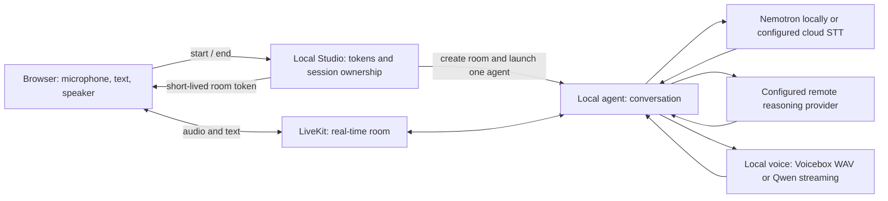

# How Studio works

## The short version

The browser talks to the local Python server to start a session. The server
creates a LiveKit room and starts one local agent for that room. The browser and
agent then exchange audio and text through LiveKit, not through the local HTTP
server.

LiveKit gives the app reliable browser media, room permissions, transcripts and
conversation hooks. Voicebox is replaceable independently of the LLM or browser.
The local server does not proxy audio, store recordings, or implement WebRTC.

## Optional fast local voice

On Apple Silicon, Studio can use `FastQwenTTS` instead of the unchanged HTTP
plugin. The agent reads one selected reference from Voicebox over loopback or
from a private, explicitly imported local bundle. It loads the existing Qwen
snapshot offline. MLX Audio 0.5.3 streams PCM chunks and retains reference
conditioning for subsequent turns. In bundle mode no Voicebox server is required.

Start session performs one private warm-up before reporting Ready. Warm-up
audio is not played or saved. The model stays in that room's agent process;
closing the room releases it. The producer thread owns its inference lease,
with a four-chunk bounded bridge and cooperative stop checks. Consumer
cancellation suppresses output immediately without claiming the thread has exited.
Unknown thread completion still blocks further work.

The provider declares `streaming=False` for LiveKit's **text-input** contract.
Streaming **audio output** does not mean it accepts token-by-token text.
This direct path does not apply Voicebox's profile effects or completed-waveform
normalization. It is an explicitly selected low-latency path, not a bit-identical
replacement for the desktop application's processed output.
See [voice performance](voice-performance.md) for measured results and limits.

## Local dispatch instead of a second daemon

Studio supervises one short-lived Python agent process per room using public
`rtc.Room` and `AgentSession` APIs. This is explicit **local dispatch**, not a
pretend cloud worker registration. There is no separately running, auto-dispatched
worker to accidentally pick up a second room.

Each process receives a server-generated room and owner identity. It connects as
an agent, registers an owner-checked stop RPC after connecting, and starts the
conversation with recording disabled and local VAD interruption detection.
Standard `lk.chat` text input is handled by LiveKit; the UI does not invent a
second chat protocol.

Speech recognition and reasoning are independent choices in private settings.
The local Nemotron sidecar is a separately provisioned CPU service, started and
stopped by Studio only when owned by it. It does not share the Qwen GPU engine.
The Copilot adapter holds one persistent, owned conversation runtime and forwards
only assistant text. Runtime tools, plugins and hooks are disabled and verified;
it does not resume or attach to an existing coding session.

Native LiveKit configuration/handoff items are metadata, not tool calls. The
adapter preserves configuration instructions as system text, ignores handoff
markers, and rejects actual tool history rather than rejecting every non-message
item. This distinction is covered by tests reproducing the actual room failure.

The broker holds an OS file lock for the backend for its entire lifetime.
The marker lives under `~/.local/state/livekit-voicebox` by default, outside a
repository checkout so two Studio worktrees contend for the same lease.
`VOICEBOX_RUNTIME_DIR` can override the directory for isolated tests.
This only coordinates participating local tooling. Voicebox Desktop and arbitrary
external clients must still be kept idle.

## Ending a session safely

Stopping playback and stopping model inference are different operations.
The plugin cannot terminate Voicebox's inference thread.

1. The UI disconnects or sends End session.
2. The broker marks the session draining and asks its agent process to stop.
3. The agent interrupts playback, closes the conversation, and closes its TTS
   provider. The independently owned HTTP generation job drains within its bound.
4. The agent reports confirmed completion and exits. Only then may the broker
   clear its durable work marker, remove the room, and admit another session.

The browser sends a heartbeat every 10 seconds. The broker ends an abandoned
session after 45 seconds without one, and caps a session at one hour. Cancellation
of a start HTTP request does not abandon the server's ongoing creation operation.
An agent that does not become ready within 60 seconds is ended and drained too.

A child crash, missing completion report, or shutdown timeout leaves the marker
in place and blocks admission. Restarting Studio alone is not recovery. Confirm
that Voicebox has stopped/restarted before using `--confirm-backend-restarted`.
This explicit flag is never set automatically from a health check.

The plugin defaults to a 60-second foreground deadline and a separate
120-second drain bound. Studio allows 150 seconds for agent shutdown plus bounded
room cleanup. It never treats a killed process as proof that inference stopped.

## Resource bounds

| Input or buffer | Bound |
| --- | --- |
| Submitted text | 800 characters per synthesis |
| Discovery JSON | 1 MiB |
| Completed WAV body | 16 MiB |
| Decoded synthesis | 30 seconds; source audio must be finite |
| Fast reference | One reference, at most 30 seconds and two channels |
| Fast producer bridge | Four PCM chunks; producer waits for room |
| Emission | Mono PCM16, cancellation checkpoints between small frames |

The normal HTTP provider supports its documented alternate output rates.
Studio's fast path is fixed at 24 kHz. Oversized, corrupt, incompatible, or
nonfinite data is an explicit failure, never a silent fallback voice.

## Tokens, secrets and browser boundaries

The server signs a two-minute browser token for one random room and participant.
It grants microphone publication, text/data and subscription, not room
administration. The raw project API secret and Azure keys never enter frontend
bundles or responses.

Session control requires a separate unguessable handle returned only to the
starting tab. The public status response does not reveal that handle. A second
tab cannot take over a session just by polling status.

The server binds to `127.0.0.1`, verifies the Host and Origin, requires an explicit
JSON/custom-header mutation request, sets no-store and browser protection
headers, and bounds request bodies. This is a localhost trust boundary, **not**
a production authentication system. Do not put it behind a public tunnel.

Azure keys are obtained through the signed-in CLI and held in the agent process.
Existing regional endpoints need key authentication; Studio does not change
resource domains, grant roles, create deployments or rotate keys.

## Why audio can take a while

Voicebox's `/generate/stream` returns HTTP chunks of an already completed WAV.
The agent cannot play its first sample until generation completes. The plugin
declares `streaming=False`; LiveKit's sentence adapter supplies sentence-level
progress. It does not make the underlying model incremental.

Keep replies short, measure LLM first-token time separately from TTS first-frame
time, and do not mistake a smoothly animated UI for faster inference.
