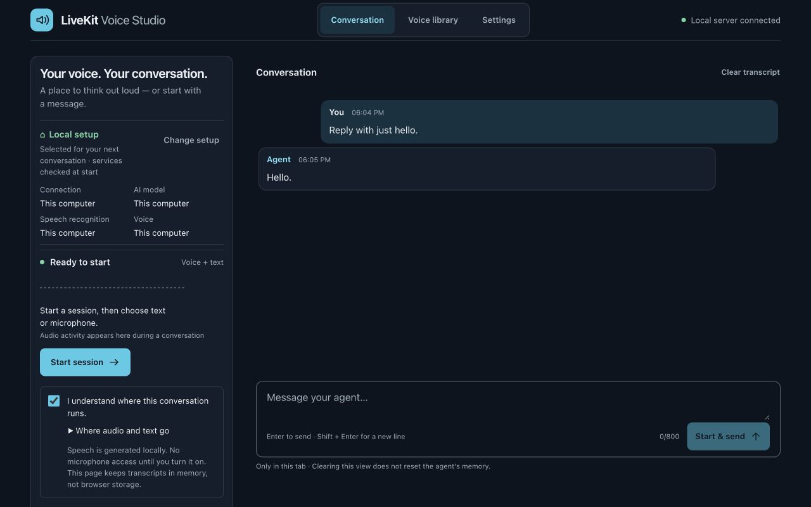

# A two-minute Studio walkthrough

This is a demo script for the real application, not a prerecorded performance
claim. Prepare an authorized voice and installed models using the quickstart.
Use ordinary test text. Keep private voice names, settings, tokens and unrelated
browser tabs out of any recording. Do not show terminal logs on screen.

| Time (approximate) | Show | Explain |
| --- | --- | --- |
| 0:00–0:20 | Conversation route, with all four components local | “LiveKit connects the browser and agent. Recognition, reasoning and voice generation are separate choices.” |
| 0:20–0:50 | Start a session with the microphone off; type “What does LiveKit do? One sentence.” | “Text skips recognition. The reply still becomes generated speech.” Allow real startup time; do not disguise it with editing. |
| 0:50–1:15 | Request a longer answer, press Stop reply, then ask a short follow-up | “Stopping audio and safely cancelling generation are different. The successful next turn checks recovery.” |
| 1:15–1:40 | How it works: room state and measured latency | “These measurements have different clocks. I don’t add them into a made-up total.” |
| 1:40–2:00 | Practice troubleshooting; End session | “The project teaches failure isolation. It is a developer preview, with hardware and recognition limitations documented.” |

If a reply fails, show the failure honestly and use the troubleshooting guide.
Do not switch to a remote provider during a private conversation to rescue a demo.
The endpoint failure lesson is better as a separate, rehearsed demonstration.

The screenshot was captured from the actual 1280×800 desktop UI, with no active
session, microphone capture or private transcript. It illustrates the interface;
it does not establish speech quality or disconnected operation.

This completed-session view shows a synthetic typed prompt and reply. Server
metrics confirmed speech generation; this screenshot is not an audio-quality test.
See the [validation record](validation-2026-09-19.md) for results and limitations.

## First independent tester

Ask a tester with an Apple Silicon Mac to follow [the first-run guide](quickstart.md)
without borrowing your configuration or voice library. They should use their own
authorized voice and record the first step that needed help. Success means:

1. Install from the public repository and understand expected missing setup checks.
2. Record a reference, hear a newly generated audition and distinguish the two.
3. Start a typed conversation, then deliberately enable speech input.
4. Stop a reply, get a follow-up, end the session and return to Ready.
5. Explain which selected components are local and which would send data remotely.

Capture OS/chip/RAM, commit, selected component names, the failing step and a
redacted error. Do not attach credentials, voice references, model files or private
conversation transcripts. A failed step is useful feedback, not a failed tester.

## Preparation and failure recovery

Run `./studio status` and use `./studio start --open` if the installed checkout is
stopped. Do not run a second standalone worker alongside Studio. Downloads and
native builds belong before the demonstration. Use `./studio stop` when you want
to shut down the managed server; ending a conversation leaves the app running.

You can demonstrate recording and audition separately: show the exact reference
transcript and explain which control plays the original and which generates new
words. Never present a stock synthetic test fixture as a person's cloned voice.
For Codex, keep the restricted-agent disclosure explicit; it is not tool-free mode.

On failure, end the session and wait for cleanup before changing providers. Never
clear an unresolved-work marker merely because a health check responds. Do not
use public tunnels or silent cloud fallback to rescue the demonstration. Human
accent, room noise, speaker likeness and natural interruption still need listening.
