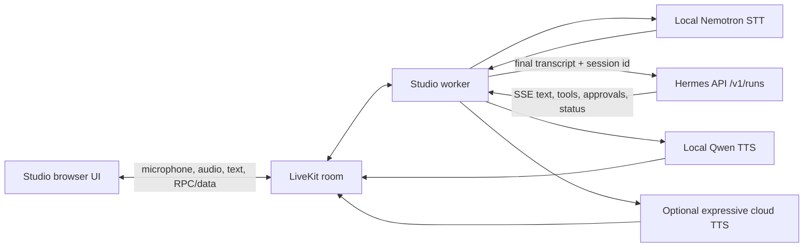

# Hermes LiveKit Voice Companion Design

**Status:** Approved direction; implementation not started

**Date:** 2026-09-16

**Repositories reviewed:**
- `c-mongan/livekit-voice-studio` at `fcee15c0671f6968eb6e80c28b520255e23605f9`
- local `NousResearch/hermes-agent` at `784d5c3f9c2cb77698d8a9d2e72b1d106a38ea88`

## Decision

Build this as an optional voice companion for Hermes.

Reuse Voicebox Studio for LiveKit room transport, browser audio, turn detection, interruption, private voice enrollment, local Nemotron STT, and local Qwen TTS. Replace its tool-free Copilot/Codex reasoning adapter with a Hermes adapter. Hermes remains the sole owner of reasoning, tools, memory, sessions, permissions, and action state.

Use two speech modes:

1. **Private local speech:** Nemotron STT and Qwen3-TTS on the Mac. LiveKit transports room audio, so this is local-model mode, not fully offline mode.
2. **Optional cloud expressive speech:** Nemotron can remain local while TTS switches to a LiveKit Inference provider that supports Expressive Mode. This is opt-in and must disclose provider, region, retention, and cost.

Do not claim that LiveKit Expressive Mode works with Qwen. Current LiveKit Expressive Mode requires a supported `inference.TTS`: Fish Audio `s2.1-pro`, Inworld `inworld-tts-2`, Cartesia Sonic, or xAI `tts-1`. Local Qwen can receive Qwen-specific style instructions later, but that is a separate feature.

## Why this is worth doing

Hermes already has voice mode, wake words, streaming TTS, barge-in, tools, memory, and approvals. Voicebox Studio adds a useful combination Hermes does not currently package as one polished path:

- streaming local Nemotron recognition;
- consent-led local voice enrollment;
- a warm local Qwen voice model;
- LiveKit browser/mobile-grade media transport;
- richer turn detection and interruption controls;
- an optional cloud expressive voice.

The project is credible OSS if it stays focused: a voice surface for Hermes, not another agent framework. The existing repository is already MIT-licensed, tested, loopback-only, and explicit about model and privacy boundaries.

## Architecture

### Ownership boundaries

| Component | Owns | Must not own |
| --- | --- | --- |
| Hermes | reasoning, tools, memory, durable session, approvals, action status | microphone, WebRTC, voice cloning |
| LiveKit AgentSession | room audio, VAD/turn detection, speech scheduling, playback interruption, synchronized transcript | tool execution, durable agent memory |
| Studio broker | loopback API, scoped room tokens, worker lifecycle, settings, private voice library | conversation reasoning |
| Nemotron sidecar | local streaming STT | conversation state |
| Qwen provider | local PCM synthesis from authorized reference | action semantics |
| Browser | mic consent, playback, transcript display, approval UI | secrets, provider credentials |

## Hermes control-plane contract

Use Hermes HTTP Runs API for the first production slice.

- Start: `POST /v1/runs`
- Stream: `GET /v1/runs/{run_id}/events`
- Read status: `GET /v1/runs/{run_id}`
- Approve or deny: `POST /v1/runs/{run_id}/approval`
- Stop: `POST /v1/runs/{run_id}/stop`
- Discover support: `GET /v1/capabilities`

Each Studio conversation gets one explicit Hermes `session_id`. Each utterance gets a unique `Idempotency-Key`. The adapter consumes `message.delta` events and emits LiveKit `llm.ChatChunk` values. It also handles terminal `run.completed`, `run.failed`, and `run.cancelled` events.

Use profile-prefixed routes, `/p/{profile}/v1/...`, when a profile is selected. Credentials stay in the worker process. The browser never receives `API_SERVER_KEY`.

### Why not use TUI JSON-RPC first

Hermes TUI JSON-RPC has richer reconnect replay, open-request recovery, clarify/secret prompts, wake control, and session multiplexing. It is also an internal desktop contract with more coupling. `/v1/runs` is the smaller documented external boundary and already supports approvals, stop, steering, SSE, durable idempotency, and explicit session identity.

Reconsider JSON-RPC only if the HTTP slice cannot meet reconnect or interactive prompt requirements.

## Turn lifecycle

1. LiveKit detects end of user turn.
2. Nemotron produces the final transcript.
3. `HermesLLM` starts one Hermes run using the conversation's durable `session_id`.
4. Hermes streams text deltas. LiveKit sentence-buffers them and sends text to the selected TTS.
5. LiveKit plays PCM and publishes the clean transcript.
6. Hermes tool activity appears as status UI; tools remain internal to Hermes.
7. A terminal Hermes event closes the LiveKit LLM stream.

Only one Hermes run may be active per room. A bounded queue protects worker memory. Deltas from retired run IDs are discarded.

## Interruption and action safety

Speech interruption and action cancellation are different events.

On barge-in:

1. LiveKit stops local playback immediately.
2. The adapter sends `POST /v1/runs/{run_id}/stop` once.
3. The adapter keeps reading until Hermes reaches a terminal status or the stop timeout expires.
4. Late deltas from that run are discarded.
5. The next turn includes a short voice-context note saying the spoken reply was interrupted.

The UI must say **“Stopped speaking”**, not **“Action undone.”** A tool may have completed before the stop reached Hermes. Completed external actions remain completed and visible in status/history.

Before release, an integration test must determine how interrupted partial assistant text is persisted in the Hermes session. The adapter must not claim that Hermes history exactly equals heard audio unless the test proves it. If necessary, store `heard_text` as voice context for the next run rather than rewriting Hermes history.

## Approval flow

Hermes remains approval authority.

1. Hermes emits `approval.request` with a redacted command, choices, and `request_id`.
2. Worker sends a targeted LiveKit data message to the owning browser participant.
3. Browser pauses automatic turn progression and displays an approval card.
4. Browser calls owner-checked RPC `hermes.approval.respond` with the exact `run_id`, `request_id`, and choice.
5. Worker posts the response to Hermes.
6. UI clears only the matching request after `approval.responded` or run termination.

Voice alone must not approve destructive actions. Initial release supports click/tap approval only. No password, verification code, secret, or payment value crosses LiveKit.

## Speech modes

### Local mode — default

- STT: existing `NemotronSTT` over loopback NeMo-Speech.cpp.
- TTS: existing `FastQwenTTS`, Qwen3-TTS 0.6B Base voice clone.
- Turn detection: begin with existing Silero VAD. A/B test LiveKit `v1-mini` before adopting it.
- Interruption: VAD mode until Nemotron produces stable aligned timestamps.
- Privacy label: “Local speech models; LiveKit carries room audio; Hermes provider receives text.”

### Expressive cloud mode — optional

- Keep same Hermes and STT paths.
- Select one supported LiveKit Inference TTS.
- Set `expressive` with disfluencies off and laughter rare.
- Show provider, cloud routing, cost warning, and recording/Insights state before session start.
- Do not silently fall back from local voice to cloud voice or between cloud providers.

Recommended first A/B candidates: Cartesia Sonic and Fish Audio `s2.1-pro`. Keep xAI as a later option because it does not publish `lk.expression` mood.

## Wake word and “Jarvis” behavior

Phase 1 starts from the Studio page and does not replace Hermes Desktop wake-word ownership.

Phase 2 may integrate Hermes wake-word control through TUI JSON-RPC or a desktop deep link. Only one process may own the microphone lease. Wake-word detection is activation, not authentication. The browser must still show the active profile and preserve normal Hermes approval rules.

Personality belongs in the selected Hermes profile/SOUL, not in the LiveKit adapter. The voice layer may control pacing and delivery but must not change factual meaning.

## Settings and secrets

Non-secret Studio settings stay in the private Studio library:

- `llmProvider: "hermes"`
- `hermesProfile`
- `hermesBaseUrl`
- `ttsMode: "local" | "expressive"`
- `expressiveProvider`
- `expressiveVoice`
- explicit privacy acknowledgement version

Secrets remain server-side environment/config values:

- Hermes API key
- LiveKit credentials
- LiveKit Inference or direct TTS credentials

Reject arbitrary remote Hermes URLs in the initial release. Allow loopback HTTP and explicitly configured HTTPS only. Never send credentials to the browser or persist them in `settings.json`.

## Error handling

- Fail startup if `/v1/capabilities` does not advertise runs, approvals, and stop.
- Fail closed if a selected Hermes profile is unavailable.
- Do not retry a run after request-body admission unless the same idempotency key is reused.
- On SSE loss, poll run status. The HTTP event stream has no replay cursor.
- Do not synthesize tool previews, reasoning, approval commands, or raw errors.
- If stop acknowledgement is uncertain, mark the conversation uncertain and require a fresh room/session.
- If TTS fails after text starts, preserve clean text and offer retry; never switch voice/provider silently.
- Existing inference lease and durable unresolved-work marker remain authoritative.

## Packaging

Keep this repository standalone. Do not fork Hermes core for v1.

Extract production code from `examples/` into a package after the vertical slice proves the bridge:

- `voicebox_studio/hermes_api.py`
- `voicebox_studio/hermes_llm.py`
- `voicebox_studio/runtime.py`
- `voicebox_studio/speech/nemotron.py`
- `voicebox_studio/speech/qwen.py`
- `voicebox_studio/speech/expressive.py`

The first bridge can land beside existing code to minimize simultaneous change. Extraction follows as a separate reviewable task.

OSS release must include:

- MIT project license;
- Apache-2.0 notices for LiveKit and Qwen;
- NVIDIA/OpenMDW notice for Nemotron weights;
- libsndfile LGPL redistribution review;
- voice-consent and misuse policy;
- no bundled model weights or recordings;
- Apple Silicon preview label until another platform passes the same suite.

## Verification gates

| Gate | Pass criterion |
| --- | --- |
| Hermes bridge | 20-turn session preserves intended context and tools remain available |
| Approval | exact request approval/denial works; wrong owner/request fails closed |
| Stop | playback stops within 200 ms and Hermes reaches terminal state |
| Action truth | completed tools remain reported after speech interruption |
| Nemotron | P95 interim lag ≤300 ms; final transcript ≤500 ms after speech; acceptable domain WER |
| Qwen 0.6B | warm P95 first audio ≤350 ms; sustained real-time factor <0.8; clean cancellation |
| Expressive A/B | listener preference improves; P95 end-to-end latency rises ≤250 ms; cost accepted |
| Privacy | Insights/recording state verified; no model traffic in declared private mode except documented LiveKit transport and Hermes text provider |
| Reliability | 50 consecutive turns, 20 interruptions, 10 approval cycles, no stale speech or leaked task |
| Packaging | clean install on a second Apple Silicon Mac passes doctor, unit, browser, and spoken smoke tests |

If the Hermes bridge, stop, action-truth, or approval gates fail, do not release as a Hermes agent. Local read-aloud may still ship separately.

## Non-goals for v1

- Replacing Hermes Desktop voice mode.
- Fully offline operation while using LiveKit Cloud or a remote reasoning provider.
- Phone access or public internet exposure of the loopback broker.
- Voice-only approval of sensitive actions.
- Multi-user or multi-room inference.
- Claiming local Qwen supports LiveKit Expressive Mode.
- Rewriting or deleting Hermes action history to match audio playback.

## Follow-up decision points

1. After the HTTP vertical slice, decide whether reconnect requirements justify TUI JSON-RPC.
2. After Nemotron timestamp tests, decide whether adaptive interruption is available.
3. After Qwen/cloud A/B tests, choose the default voice mode.
4. After second-machine validation, decide whether to publish as Apple Silicon preview.